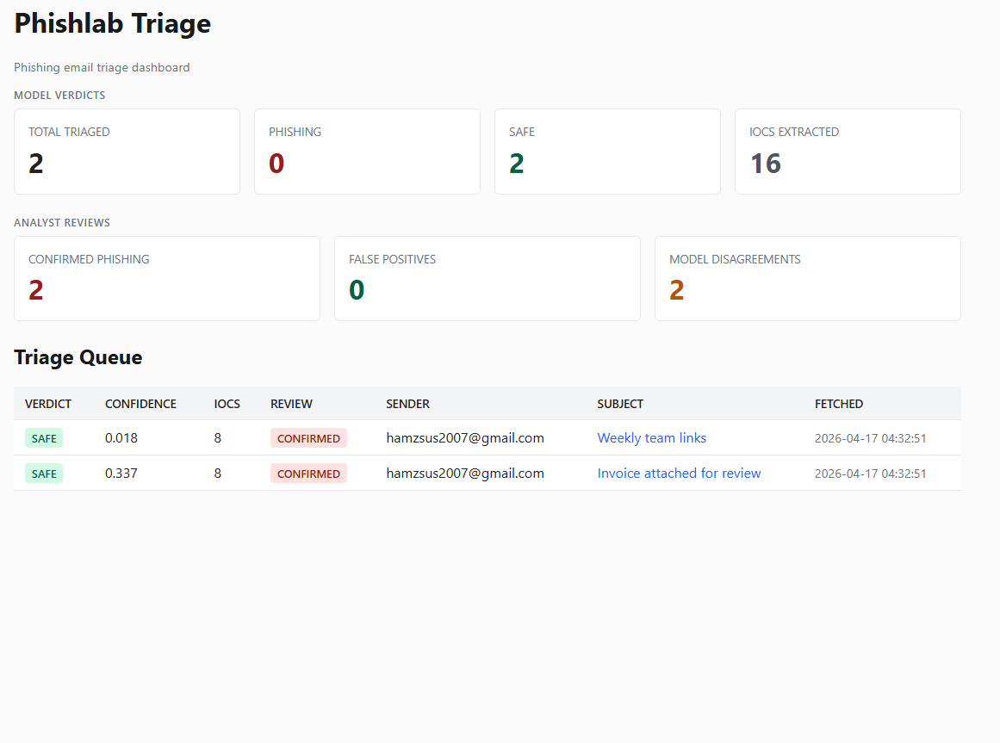
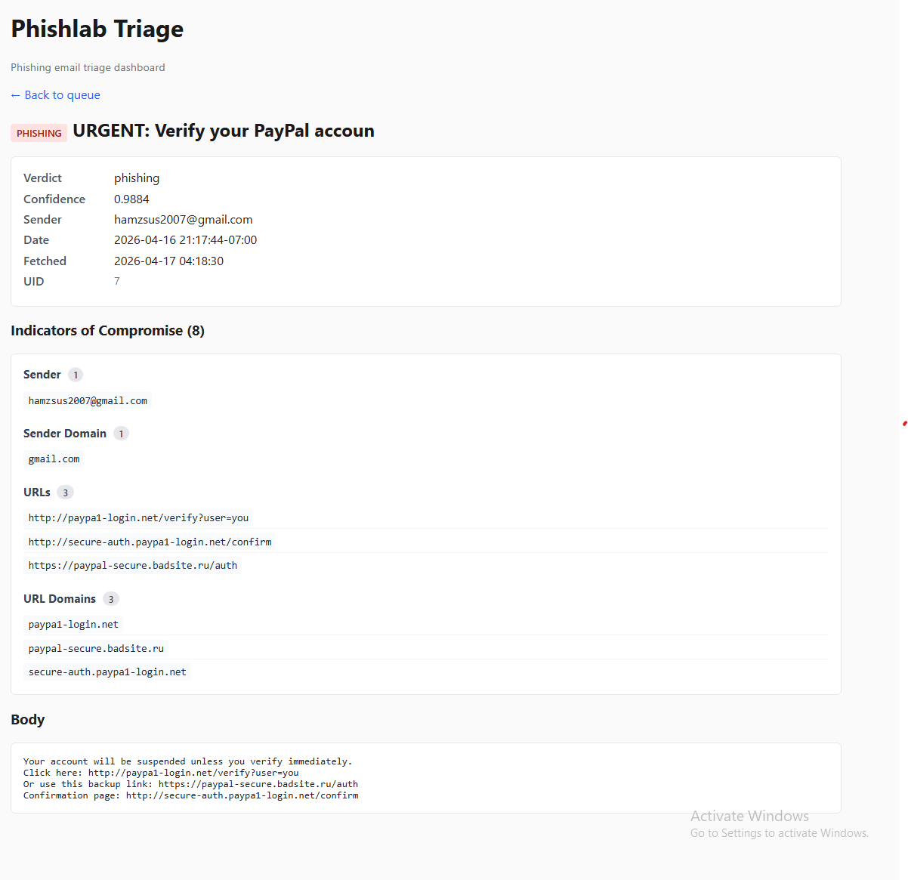
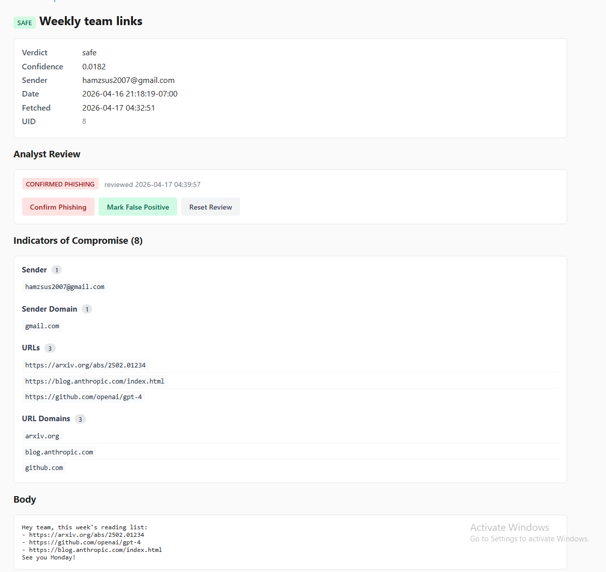

# Phishlab — AI Phishing Email Triage

A tool that checks emails for phishing and helps a security analyst decide what to block. Built to practice the kind of work a SOC Tier 1 analyst does every day.

Users forward suspicious emails to a Gmail inbox. A Python service pulls them, runs them through a machine learning model, pulls out the important bits (sender, URLs, IPs), and shows everything in a web dashboard. The analyst reviews each email and clicks Confirm Phishing or Mark False Positive.

**At a glance:**
- 18,634 emails used for training
- 96% accuracy, 0.99 ROC-AUC
- 4 SQLite tables, 3 Flask routes, 7 IOC types extracted
- End-to-end pipeline: Gmail → IMAP → ML model → SQLite → Flask dashboard

---

## What it does

- **Reads emails from Gmail** using IMAP
- **Scores each email** with a trained machine learning model (is this phishing or safe?)
- **Pulls out IOCs** (indicators of compromise) — sender address, sender domain, URLs, URL domains, IP addresses, attachment hashes
- **Saves everything to a SQLite database**
- **Shows results in a web dashboard** with a queue page and a detail page per email
- **Lets the analyst override the model** with Confirm Phishing / Mark False Positive buttons
- **Tracks disagreements** between the model and the analyst, so future model training can learn from them

---

## Key skills demonstrated

- **Machine learning engineering** — trained a TF-IDF + Logistic Regression classifier on 18K emails, diagnosed dataset bias through feature importance analysis, retrained with preprocessing + structural features to improve generalization.
- **Email security fundamentals** — IMAP integration, email parsing (MIME, headers, multipart), IOC extraction (sender, URLs, domains, IPs, attachment hashes).
- **Python development** — clean package structure, SQLite persistence, Flask web application with Jinja2 templates, credential management via `.env`.
- **SOC analyst workflow design** — built a tool that mirrors Cofense Triage / Proofpoint TRAP: queue, triage, IOC display, analyst override, disagreement tracking.
- **Secure coding practices** — gitignored secrets, UPSERT-based idempotency, parameterized SQL queries, CHECK constraints for input validation.

---

## Why I built it

Phishing triage is a core SOC workflow. Tools like Cofense Triage and Proofpoint TRAP pull user-reported emails, score them, extract indicators, and hand them to an analyst for review.

I wanted to build that workflow myself — not just use it — to see where the real engineering lives: the ML model, the IOC extraction, the feedback loop, the tradeoffs you don't see until you've built the pieces.

---

## Screenshots

**Email detail view with IOCs:**

The model scored this phishing email at 98.84% confidence. The IOC section shows the sender, URLs, and URL domains that an analyst would actually add to a blocklist. Notice `paypa1-login.net` — the attacker used a "1" instead of an "l" to fake PayPal's domain. The tool caught it.

**Analyst review applied:**

Clicking Confirm Phishing or Mark False Positive writes to the database. The queue page counts how many times the analyst disagreed with the model. Those are the emails worth retraining on.

---

## The ML part — how I fixed a broken model

The first version of my model got 97% accuracy on the test set. Looked great. Then I looked at what the model actually learned.

**Top "safe" words the model learned:**
- `enron` (-7.2)
- `vince` (-3.4)
- `louise` (-2.9)
- `linguistics` (-3.3)
- `2001`, `2002` (dates)
- `713` (Houston area code)

**Top "phishing" words:**
- `2004`, `2005` (dates)
- `spamassassin sightings`

The problem: my training data came from two sources. Legitimate emails were from the Enron email corpus (2001-2002, written by Enron employees in Houston, plus some academic mailing lists). Phishing emails were from 2004-2005 SpamAssassin traps. So the model didn't learn "phishing vs safe." It learned "old Enron emails vs old SpamAssassin spam."

If I deployed this on a real 2026 inbox, it would flag legitimate emails as suspicious just because they don't mention "Enron" or "Vince."

### What I changed

1. **Cleaned the text** — replaced URLs with `<url>`, emails with `<email>`, removed years, replaced numbers with `<num>`. The model can still learn that URLs exist (useful), but can't memorize specific domains.
2. **Extended stopword list** — added `enron`, `vince`, `louise`, `spamassassin`, `sightings`, `713`, etc. to the ignore list.
3. **Added structural features** — things that don't depend on specific words: number of URLs, number of exclamation marks, uppercase ratio, urgency keywords (urgent, verify, suspended, click here, etc.).

### Results

| | v1 | v2 |
|---|---|---|
| Accuracy | 97% | 96% |
| ROC-AUC | 0.9953 | 0.9941 |
| Top phishing features | `click, 2005, spamassassin sightings` | `click, verify, urgency_hits, exclamation_count` |
| Top safe features | `enron, vince, 2002, linguistics` | `thanks, attached, meeting, text_length` |

I lost 1% accuracy. But the model now learns real phishing patterns, not a specific dataset. That's a trade worth making.

**What this taught me:** a high accuracy number doesn't mean a good model. Always look at what your model actually learned. Real SOC tools have this problem constantly — a model trained on last year's attacks doesn't catch this year's.

---

## How it works

    Gmail abuse inbox
           |
           | IMAP
           v
     poller.py  ------> ML model (v2)
           |       \
           |        \--> IOC extractor
           |         \
           v          v
        SQLite database
           ^
           |
           v
     Flask dashboard  <-- Analyst reviews

**Tech used:**
- Python 3.12
- scikit-learn 1.8 (TF-IDF + Logistic Regression)
- Flask (web dashboard)
- SQLite (storage)
- imap-tools (Gmail connection)
- python-dotenv (secrets)

**Database tables:**
- `emails` — raw email data
- `verdicts` — model's decision and confidence score
- `iocs` — extracted indicators
- `analyst_reviews` — analyst's decisions

---

## How to run it

### What you need
- Python 3.12 (3.10+ probably works too)
- A Gmail account with 2-Step Verification enabled
- A Google [app password](https://myaccount.google.com/apppasswords) for that account

### Setup

    git clone https://github.com/YOUR_USERNAME/phishlab.git
    cd phishlab

    # Make a virtual environment
    python -m venv .venv
    .venv\Scripts\activate      # Windows
    source .venv/bin/activate   # Mac/Linux

    # Install packages
    pip install -r requirements.txt

    # Set your Gmail credentials
    cp .env.example .env
    # Then edit .env with your values

    # Download the training data from Kaggle:
    # https://www.kaggle.com/datasets/subhajournal/phishingemails
    # Save it as: data/Phishing_Email.csv

    # Train the model
    python model/train_v2.py

    # Run the poller (pulls emails, scores them)
    python -m phishlab.poller

    # Start the dashboard
    python -m phishlab.dashboard
    # Open http://127.0.0.1:5000

### Daily workflow
1. Users forward suspicious emails to your Gmail abuse inbox
2. Run the poller — it pulls new emails, scores them, extracts IOCs
3. Open the dashboard, review the queue, click into any email
4. Hit Confirm Phishing or Mark False Positive
5. The dashboard shows how often you disagree with the model

---

## What this does NOT do

Real enterprise email security has many layers. My project is one of them — the ML content analysis + analyst triage layer. In production you'd also want:

- **Sender authentication** — SPF/DKIM/DMARC header checks to verify the sender is who they claim. That's Layer 1 and catches most commodity phishing before ML even runs.
- **URL sandboxing** — tools like Proofpoint open suspicious URLs in a sandbox after delivery in case they get weaponized later. My tool just lists URLs for the analyst.
- **Behavioral detection (BEC)** — tools like Abnormal Security learn who normally emails whom inside your org. Can't build that in a home lab without real organizational email data.

My text-based ML catches vocabulary phishing. Real tools catch vocabulary *plus* URL reputation *plus* sender authentication *plus* behavior. One layer alone isn't enough — and that's fine, because I didn't set out to build a full stack.

### A failure I caught

One of my test emails had the subject "Invoice attached for review" and a body linking to `http://185.243.22.14/invoice-48291.pdf`. This is clearly phishing — IP-based URLs are a huge red flag. But my model scored it only 0.337 (safe).

Why? The model was trained on text. This email's words were pretty neutral ("please review the attached invoice"). The phishing signals were in the URL structure, not the words.

This is why real email security has many layers. The dashboard shows this honestly — the Model Disagreements counter captures exactly these misses.

---

## Lessons learned

- **Test accuracy lies.** 97% on a held-out test set meant nothing when the model had memorized corpus-specific tokens. Feature importance analysis is mandatory, not optional.
- **ML is one layer, not a solution.** My text classifier caught vocabulary phishing (0.988 on the PayPal spoof) but missed the IP-URL invoice email (0.337). Real email security needs 4–5 layers working together. Understanding this tradeoff is more valuable than any single-layer accuracy number.
- **Idempotency isn't optional for polling services.** The first version re-triaged the same emails on every restart. A `UNIQUE` constraint on the message UID fixed it — a small change that matters because real SOC tools run 24/7.
- **Credentials don't belong in screenshots.** During development I once pasted a Gmail app password visible in a browser screenshot. I revoked it within 60 seconds, but the lesson stuck: treat every credential as live until proven gone.

---

## Project layout

    phishlab/
    ├── phishlab/
    │   ├── config.py           # Loads .env
    │   ├── preprocess.py       # Text cleaning + features
    │   ├── ioc_extractor.py    # Pulls IOCs from emails
    │   ├── db.py               # Database schema + queries
    │   ├── poller.py           # Main pipeline (IMAP + scoring)
    │   ├── dashboard.py        # Flask app
    │   └── templates/          # HTML templates
    ├── model/
    │   ├── train.py            # v1 model (has dataset bias)
    │   ├── train_v2.py         # v2 model (fixed bias)
    │   └── artifacts/          # Saved models (gitignored)
    ├── data/                   # Training data (gitignored)
    ├── Images/                 # Dashboard screenshots
    ├── requirements.txt
    ├── .env.example
    ├── .gitignore
    └── README.md

---

